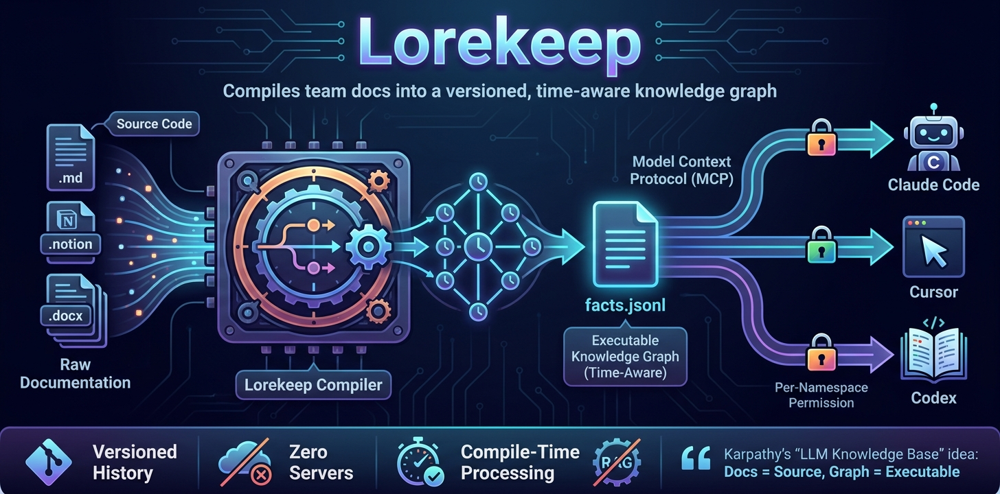

# Lorekeep

<p align="center"></p>

**A file-sovereign, temporal knowledge graph shared by you and your coding
agents over MCP.**

[](LICENSE)

Lorekeep compiles Markdown from multiple namespaces into a deterministic
`facts.jsonl` graph, projects that graph into a human-readable Obsidian/Tolaria
wiki, and exposes a compact namespace-scoped MCP surface to Claude Code, Cursor,
Codex, and opencode. Agents can also propose facts during a session; proposals
land in append-only journals and become visible after a confidence-gated resolve.

The LLM work happens during compile or an explicitly requested deep import.
Ordinary graph queries, journal writes, resolve, wiki generation, lint, and
status checks do not call another LLM.

## What is available today

| Area | Current behavior |
|---|---|
| Compile | `raw/<ns>/*.md` → schema-constrained extraction → resolve → sorted `facts.jsonl` + manifest + wiki |
| Query | Seven MCP tools plus passive schema, namespace, and status resources |
| Permission | Deny-by-default namespace filtering through one `ScopedGraph` chokepoint |
| Time | Half-open validity windows plus snapshot, history, and change queries |
| Agent input | Session import and hooks for Claude Code, Cursor, Codex, and opencode |
| Agent writes | Namespace-enforced, confidence-gated journals; no direct graph mutation |
| Automation | Watch raw docs, journals, memories/transcripts, agent wiring, backup sync, and restart after an external package upgrade |
| Human view | Deterministic, readable Markdown wiki for Obsidian and Tolaria |
| Operations | Runtime logs, redacted support bundles, install diagnostics, and optional automatic GitHub issues |

Lorekeep is suitable for one person using several coding agents and several
devices, with an important current constraint: Git backup/sync is sequential.
Simultaneous edits to the same raw document or journal can still require manual
conflict resolution. A shared authenticated team server is roadmap work, not a
shipped capability.

## Install

Python 3.11+ and [uv](https://docs.astral.sh/uv/) are required.

```bash
# Run without a permanent install
uvx lorekeep version

# Recommended when using the daemon/service continuously
uv tool install lorekeep
lorekeep version
```

**Without uv** (pipx or pip):

```bash
curl -fsSL https://raw.githubusercontent.com/manhhailua/lorekeep/main/scripts/install.sh | bash
```

For development from source:

```bash
git clone https://github.com/manhhailua/lorekeep.git
cd lorekeep
uv sync
uv run lorekeep version
```

### Update

```bash
lorekeep update          # upgrade to latest
lorekeep update --check  # show current vs latest without upgrading
```

## Quickstart

```bash
# 1. Interactive setup: config + schema + profile + agent wiring + initial import
lorekeep init

# 2. Add Markdown under the raw directory printed by init
mkdir -p ~/.local/share/lorekeep/raw/backend
cp your-docs.md ~/.local/share/lorekeep/raw/backend/

# 3. Compile raw docs, merge journals, and regenerate the wiki
lorekeep compile

# 4. Inspect installed/active/wired coding agents
lorekeep agent detect

# 5. Validate graph, schema, MCP, and provider connectivity
lorekeep doctor
```

`init` is idempotent. On its first interactive run it selects a provider and
namespace, writes `about.md` + `profile.md`, detects installed coding agents,
writes their MCP configuration and supported session-end hooks, quick-imports
available memory files, compiles when a usable provider key exists, and starts a
background watcher unless `--no-watch` is passed.

If an agent was not detected, wire it explicitly:

```bash
lorekeep mcp add --agent codex --scope user --ns backend
# or use the registry-aware command:
lorekeep agent wire --agent codex --scope user --ns backend
```

Restart the coding agent after its MCP configuration changes. Open the generated
wiki with `lorekeep wiki --open`, or select the printed `wiki/` directory in
Obsidian/Tolaria.

For non-interactive setup, use `lorekeep init --yes --no-watch`; add a provider
key and run `lorekeep compile` afterwards.

## Runtime model

```text
COMPILE / CURATE

raw/<ns>/*.md ──> chunk ──> extract(LLM, cached) ──> resolve ──┐
                                                               │
pending/<ns>/journal.jsonl ──> confidence gate + replay ────────┤
                                                               v
                                         facts.jsonl + manifest.json
                                                   │
                                                   ├──> wiki/*.md
                                                   └──> local FTS cache

SERVE / USE

facts.jsonl ──> GraphStore ──> ScopedGraph(allowed namespaces) ──> MCP
     ^                    lazy reload on facts.jsonl mtime             │
     └──────────── resolve <──── namespace journal <──── agent write ─┘
```

Raw Markdown, `schema.json`, and accepted/pending journals are the durable
knowledge inputs. The graph, manifest, wiki, cache, and FTS index are derived and
can be rebuilt on each device.

### Compile, resolve, and wiki

`lorekeep compile` is the normal all-in-one operation:

1. chunk `raw/` with `path:line` provenance;
2. extract typed nodes, edges, aliases, summaries, and relation descriptions;
3. resolve aliases, validate facts, and quarantine invalid candidates;
4. write sorted `facts.jsonl` and `manifest.json` atomically;
5. replay/merge journals when present; and
6. generate the wiki once from the final graph.

Unchanged chunks use a hash cache, so they do not repeat extraction calls;
sorted publication keeps the resulting graph byte-stable for unchanged inputs.

Use the narrower commands when only the derived view or journals changed:

```bash
lorekeep resolve       # merge pending journal entries; zero LLM calls
lorekeep wiki --open   # re-project the existing graph; zero LLM calls
```

### Daemon and service

`lorekeep agent watch` polls at a configurable interval (60 seconds by default)
and currently performs event-driven maintenance:

- raw file count/mtime or schema change → compile;
- journal mtime change → resolve;
- Claude/Codex memory change → quick import;
- supported live transcripts → bounded Markdown dumps under `raw/`;
- detected agent change → idempotent MCP/hook wiring;
- successful compile → self-heal, wiki refresh, and backup sync when configured;
- installed Lorekeep version change → restart the running watcher.

It does **not** currently run nightly lint, weekly suggestions, or an autonomous
schema-evolution scheduler. Run those one-shot operations explicitly:

```bash
lorekeep agent lint
lorekeep agent lint --auto-fix
lorekeep agent suggest
lorekeep agent status
```

For login/restart persistence:

```bash
lorekeep agent service install
lorekeep agent service status
```

## MCP contract

The runtime exposes exactly seven composable tools:

| Tool | Purpose |
|---|---|
| `search(query, limit=10)` | Find visible nodes by id, type, and properties |
| `get_node(id)` | Fetch one visible node with properties and provenance |
| `neighbors(id, edge_type="", depth=1)` | Traverse visible edges in both directions, up to five hops |
| `temporal_query(mode, params)` | `at_time`, `history`, or `changes` |
| `context(section="all", topic="")` | Ontology, visible namespaces, coverage, freshness, and pending count |
| `propose_change(operation, payload, confidence)` | Journal a `create`, `link`, or complete-props `update` |
| `review_note(kind, description, fact_ids=None)` | Record a contradiction or improvement for curator review |

Clients that support MCP resources can also read:

- `lorekeep://schema`
- `lorekeep://namespaces`
- `lorekeep://status`

Every graph-fact query and graph statistic goes through `ScopedGraph`. Effective
visibility is the configured scope plus `public`; an edge is returned only when
its own namespace and both endpoints are visible. Static schema and aggregate
compile/pending operational metadata are process-wide. Write namespaces come
from the verified server scope, not from caller payloads.

Making the MCP server available does not guarantee that every coding agent will
choose to call it. `init` and `mcp add` print an instruction snippet that tells
the agent to use this retrieval sequence:

```text
context(section="status") → search(query) → get_node(id) → neighbors/temporal_query
```

Keep that snippet in the agent's project/user instructions when the client does
not persist it automatically. Agents should cite `src`, check graph freshness,
and treat “not found” as “absent or outside this namespace,” not proof that a
fact does not exist globally.

## Configuration

All model names must use LiteLLM's `{provider}/{model}` form. Native providers
include OpenAI, Anthropic, DeepSeek, DashScope/Qwen, Gemini, OpenRouter, Mistral,
Groq, Together AI, and others exposed by LiteLLM. Ollama, vLLM, and LM Studio are
available for local/custom endpoints.

```yaml
provider:
  model: deepseek/deepseek-chat
  api_key_env: DEEPSEEK_API_KEY
  timeout_seconds: 120
  max_retries: 2
compile:
  language: en
ns:
  default: [me]
  personal: me
agents:
  enabled: [claude, codex, cursor, opencode]
  auto_wire: true
  wire_scope: user
  watch_transcripts: true
  self_heal: true
```

Prefer `provider.api_key_env`. An inline `provider.api_key` is accepted only in
the local gitignored `config.yaml`. Native providers normally need no
`api_base`; set it for Ollama on a non-default host or another custom
OpenAI-compatible endpoint. See the validated
[configuration example](.lorekeep/config.yaml.example).

Change settings without editing YAML:

```bash
lorekeep config show
lorekeep config set provider.model openrouter/deepseek/deepseek-chat
lorekeep config set provider.api_key_env OPENROUTER_API_KEY
lorekeep config set compile.language vi
lorekeep config set ns.default me,backend
lorekeep config set agents.wire_scope user
```

Optional LiteLLM tracing is available through Langfuse or LangSmith by setting
`observability.provider` and the corresponding environment credentials.

`compile.language` is a lowercase ISO 639-1 code, defaults to `en`, and keeps
LLM-extracted names, summaries, and descriptions consistent even when source
files mix languages. Changing it invalidates the relevant extraction cache
entries on the next compile. Raw Markdown, proper nouns, stable IDs, and
technical identifiers are preserved.

## Data home and paths

Path precedence, high to low:

1. per-path `LOREKEEP_RAW`, `LOREKEEP_OUT`, `LOREKEEP_CACHE`,
   `LOREKEEP_SCHEMA`, `LOREKEEP_CONFIG`, `LOREKEEP_PENDING`, `LOREKEEP_WIKI`,
   or `LOREKEEP_LOGS`;
2. `LOREKEEP_HOME`;
3. development mode (`.lorekeep/` in the current checkout or
   `LOREKEEP_DEV=1`); and
4. default dotdir `~/.lorekeep/`.

All platforms (Linux, macOS, Windows) default to `~/.lorekeep/` for both
config and data. See the
[data-home guide](docs/guides/data-home.md) for other platforms and overrides.

## Backup and multi-device use

Initialize a separate **private** Git remote for the resolved data home:

```bash
lorekeep backup --init https://github.com/<you>/lorekeep-data.git
lorekeep backup
```

The backup commits durable raw/schema/journal inputs **and** the latest compiled
`graph/` + `wiki/` snapshot, so a restored device can query and browse without
an immediate LLM compile. Local config/secrets, extraction cache, FTS, runtime
logs, Obsidian device settings, and transient files remain ignored. Both inputs
and the full-graph snapshot can contain sensitive context, so the remote must
remain private.

The watcher fetches/rebases at startup and synchronizes after a successful
compile. Manual `lorekeep backup` also fetches/rebases before pushing. Generated
graph/wiki files are marked non-mergeable: Git may merge durable source files,
but it cannot silently line-merge two compiled snapshots. Concurrent snapshot
publication requires resolving durable inputs and compiling once. Lorekeep does
not yet provide conflict-free simultaneous editing or a central reconciler.

## Diagnostics and support

`lorekeep doctor` is the pass/fail installation check. Runtime logs live under
the resolved `logs/` directory and avoid prompts, raw docs, fact properties,
journal payloads, and credentials.

```bash
lorekeep doctor
lorekeep agent service status
lorekeep support                 # print report + create redacted ZIP
lorekeep support --report-only
lorekeep support status          # automatic issue-reporting state
lorekeep support off             # disable automatic issue creation
```

The support bundle contains an allowlisted report, redacted log tail, and
manifest counters—not raw knowledge or configuration. See
[runtime logging and bug reports](docs/guides/runtime-logging.md).

## Current limits

- Search is keyword/FTS plus graph traversal; hybrid/vector retrieval is planned.
- Git sync is sequential; conflicting simultaneous edits need manual resolution.
- Local stdio is the supported transport; authenticated shared-team HTTP hosting
  and OIDC/SSO are not shipped.
- Lint, suggest, and contribution analysis are one-shot commands, not scheduled jobs.
- There are no built-in software-source connectors for repositories,
  observability systems, CI, Confluence, PDFs, or URLs yet.
- Coding-agent tool use depends on the client's MCP support and instructions.

See the [roadmap](docs/ROADMAP.md) for unshipped directions. Architecture docs
describe only current behavior unless a section is explicitly marked planned.

## Development

```bash
uv sync
uv run pytest
uv run pytest tests/test_core_regression.py -q
uv run python scripts/generate_cli_reference.py --check
uv build
```

Tests use `FakeProvider`; no API key or network call is required. Determinism and
the compact seven-tool MCP surface are regression contracts.

## Documentation

Start at the [documentation index](docs/README.md).

- [Getting started](docs/guides/getting-started.md)
- [Compiling and resolving](docs/guides/compile.md)
- [Importing agent sessions](docs/guides/import.md)
- [Serving the graph over MCP](docs/guides/serve.md)
- [Browsing the wiki](docs/guides/wiki.md)
- [Backing up and syncing](docs/guides/backup.md)
- [Runtime logging and bug reports](docs/guides/runtime-logging.md)
- [Architecture overview](docs/architecture/overview.md)
- [Generated CLI reference](docs/reference/cli.md)

## License

Lorekeep is released under the [MIT License](LICENSE).
